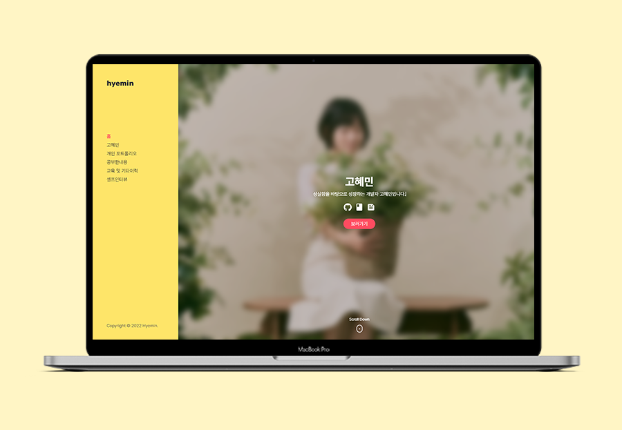
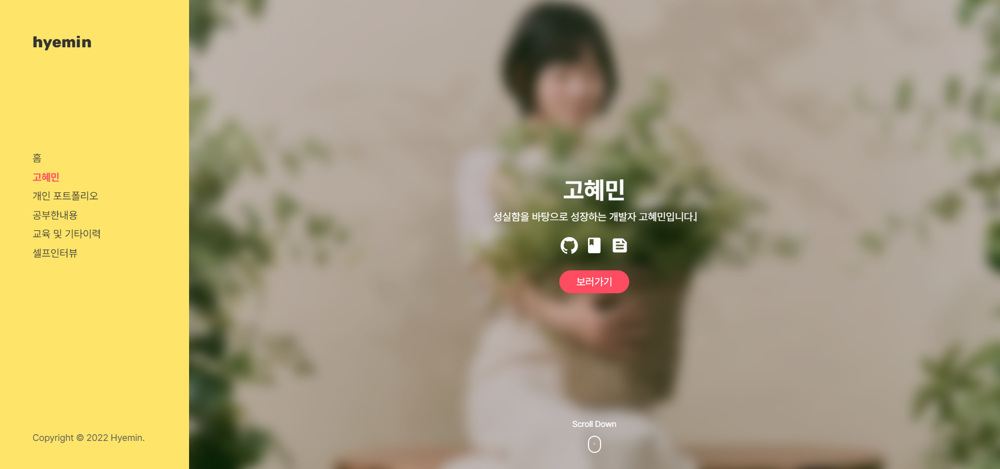
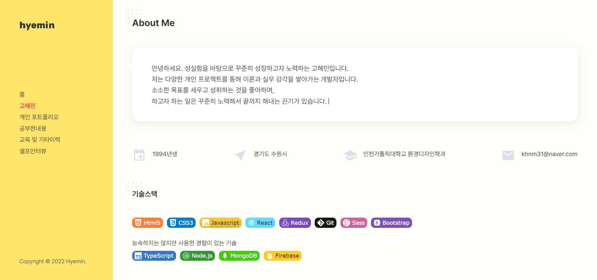
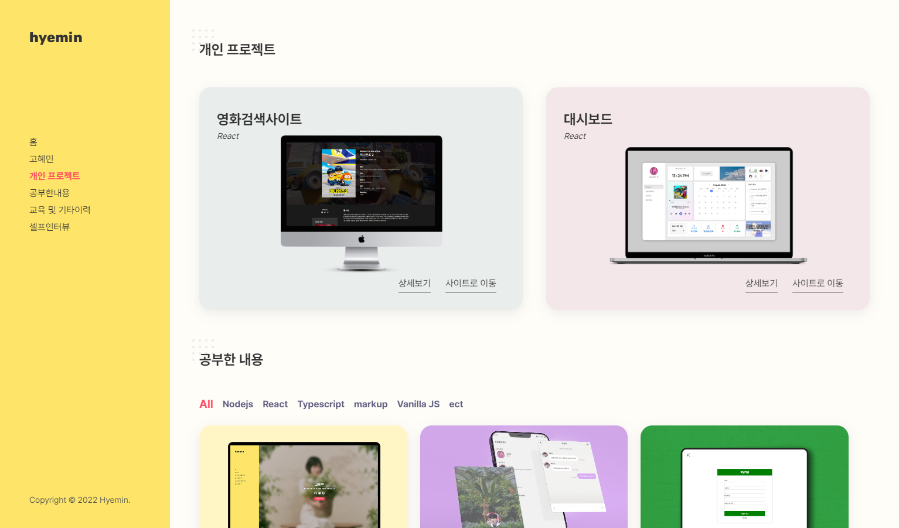
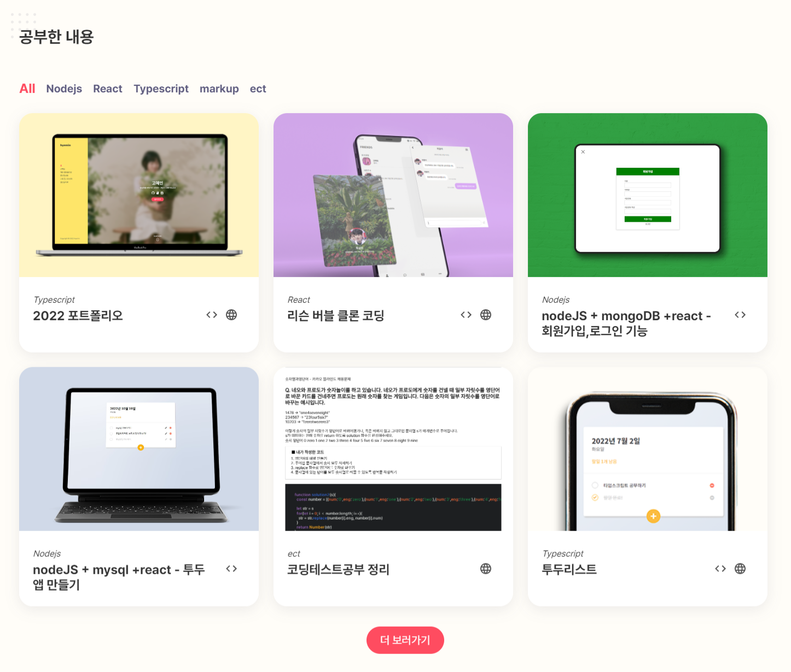
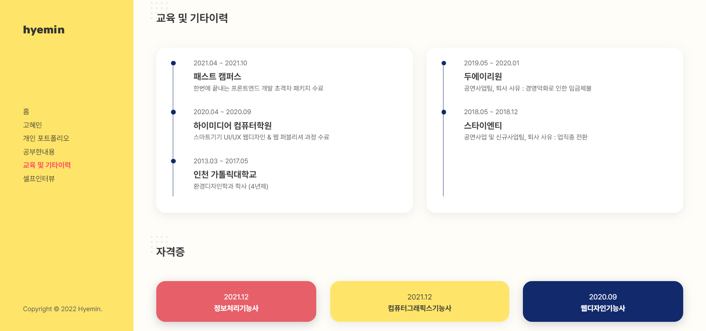
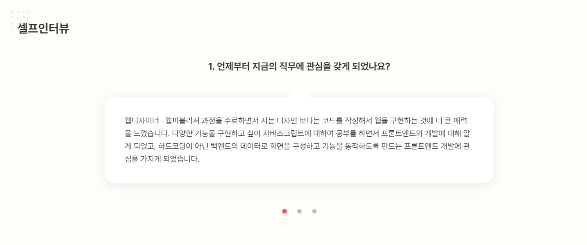
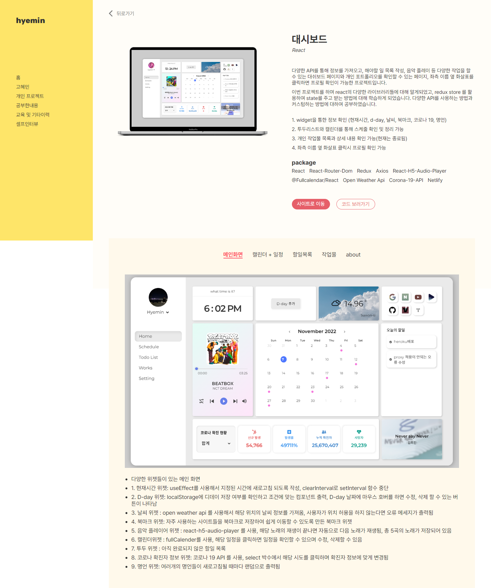
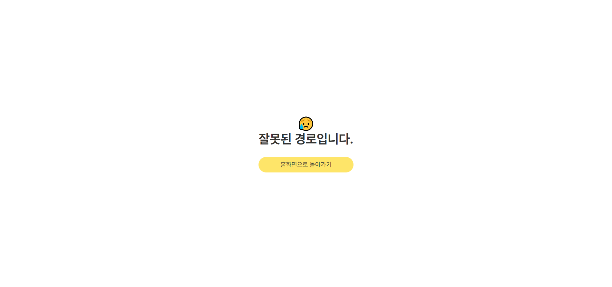
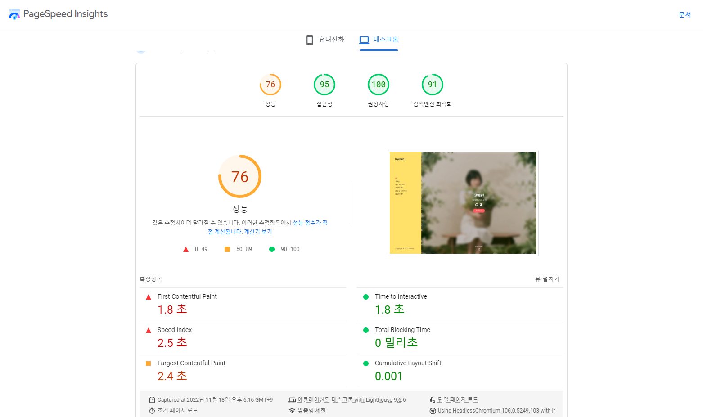

# 2022 포트폴리오

이미지를 클릭하면 사이트로 이동합니다.

 

---

## #package

- typescript
- react-slick
- typeit
- @mui/icons-material

---

## #route

- Home
  - 프로젝트, 공부한 내용, 교육이력, 자격증, 셀프인터뷰
- DetailPage
  - 프로젝트 디테일 페이지
- NotFound
  - 잘못된 루트로 이동했을 경우 나타나는 페이지

---

## #Home

- 새로고침을 하거나 처음 방문하게 된다면 1초동안 loading 화면이 나타나고, 그 이후에 Home 화면이 출력됨

### 1. Intro Section

구성 : 이름 + 간단한 소개 + 깃허브 , 블로그, 이력서 링크

- Typeit 라이브러리를 이용해 간단한 소개 멘트를 키보드로 글씨를 치는 듯한 애니메이션을 구현

---

### 2. About Section

구성 : 자기소개 + 기본정보 + 가지고 있는 기술 스택

- Typeit 라이브러리를 이용해 자기소개 멘트를 키보드로 글씨를 치는 듯한 애니메이션을 구현

- 사용 가능한 기술과 능숙하지는 않지만 사용해본 경험이 있는 기술 스택을 기술함

---

### 3. 개인 프로젝트 Section

구성 : 개인 프로젝트 리스트

- 상세보기 버튼을 누르면 디테일 페이지로 이동해 보다 프로젝트에 대해 자세한 내용을 알 수 있음

---

### 4. 공부한 내용 Section

구성 : 개발 공부를 하며 작업했던 개인 프로젝트들

- 더 보기 버튼을 누르면 6개씩 추가로 나타나며, 전체 길이가 모두 출력되고 나면 더보기 버튼이 사라짐
- React.memo()를 사용해 추가 버튼을 클릭했을 때 불필요한 렌더를 막음 (이전에 렌더링된 값들은 렌더X)
- 상단에 필터를 누르면 해당 키워드에 맞는 데이터들만 필터링되어 나타남
- git , 배포 사이트 url의 여부에 따라 각각 다른 버튼들을 출력함
- <> 버튼을 누르면 코드 (Github) 사이트로 이동
- web 버튼을 누르면 배포 사이트로 이동

---

### 5. 교육 및 기타 이력 Section

구성 : 교육 이력 + 개발 관련 외 기타 이력 + 자격증

---

### 6. 셀프인터뷰 Section

구성 : 질문에 답하는 인터뷰 내용 (3개)

- react-slick을 이용하여 슬라이드 형태로 인터뷰 내용을 나타냄
- 하단 페이지네이션을 클릭하면 다음 인터뷰 내용을 볼 수 있음

---

## DetailPage Route

구성 : 프로젝트의 상세 정보를 확인할 수 있는 페이지

- 상단 부분에는 기본적인 정보들이 작성되어 있음
- 하단 부분은 tab 형식으로 제작되었으며, 각 route 별 설명을 확인 할 수 있음
- 뒤로가기 버튼을 누르면 이전 화면으로 돌아감 (navigate(-1))

---

## NotFound Route

구성 : 찾을 수 없는 페이지 멘트 + Home으로 이동할 수 있는 버튼

 

---

 

## 성능 최적화하기

[성능개선하기]

- 이미지 크기가 커서 로드가 오래 걸림 =>  
  png/jpg 이미지 파일들을 webp 파일로 변환해서 이미지 로드 최적화  (성능 65 → 77으로 업그레이드됨)

[접근성 높이기]

- a 태그 (링크) 안에 아이콘이 들어있어서 인식하지 못하는 링크들에 캡션을 달아서 인식 가능하게 하기
- 웹 폰트 로드 중에 폰트 보여지게 하기  (display: swap); 태그 작성
- li를 가지고 있지 않은 ul 태그 div 태그로 바꾸기 
  => 접근성 89 → 95 로 업그레이드 됨

